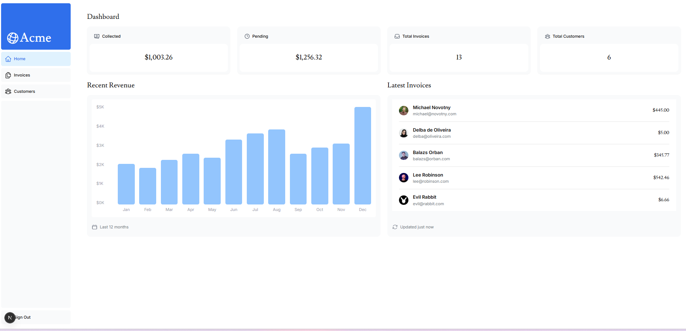

# Next.js Demo Dashboard App



This is a demo application based on the official **Next.js dashboard example**, extended with modern tooling and key features for a full-stack app.

[Demo](https://next-js-dashboard-learn-pied.vercel.app/signup)
## Features

- **Next.js App Router** (app directory)
- **Better Auth** for user authentication
- **Prisma ORM** for database management
- **PostgreSQL** as the relational database
- Full **Sign Up / Login** flow
- **OAuth login** with **GitHub** and **Google**
- Responsive and accessible UI
- Server Actions (`useActionState`) for form handling


---

##  Getting Started

### Install dependencies

You can use either `pnpm` or `npm`:

```bash
pnpm i
```


### Development server
```bash
pnpm dev
```

## Configuration
### Environment Variables
Create a .env file in the root with the following varibles in the ``.env.sample```


## Prisma ORM
The Prisma schema is located in prisma/schema.prisma.

To generate the Prisma client:

```bash
pnpm run prisma:generate
```